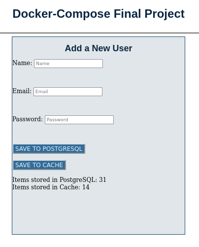
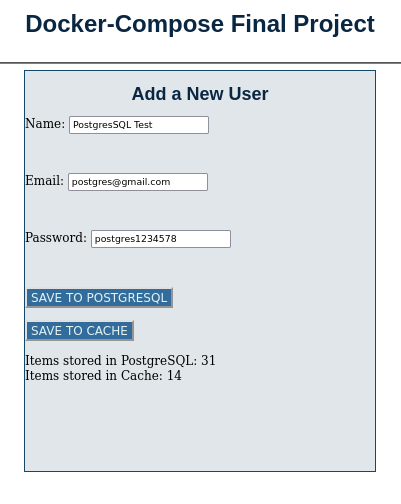
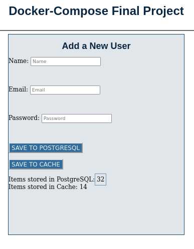
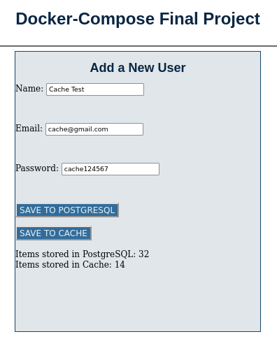
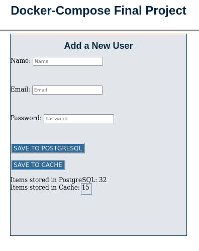

# | Docker + Docker-compose | Final Project
# Project description:
This is an application infrastructure in a local environment using Docker and Docker-compose.

This application infrastructure consist of 3 containers that are going to be created using docker-compose, for this infrastructure a network is going to be created using the file docker-compose.yml. The 3 containers are going to be in the same network, cause the Web Server container needs to communicate with PostgreSQL and Redis.

Containers: 
* Web Server(python:3.7-alpine, Flask)
* PostgreSQL:14.2 for the Relational database engine.
* Redis:7.0.0 as cache engine
# This is the main project screen
Each time data is typed and save the "Item stored" is going to increase by 1, based on the button selected to save.

Use the following link to display the Form that needs to be use to
create the users.(Make sure to include "/create/ as showing below.

[http://localhost:5000/create/](http://localhost:5000/create/)



#For the commands in this project use "sudo" at the beginning of each command if root permissions required.
### Command to clone the repository from GitHub.
```bash
git clone https://github.com/IsraelAlonzoMoran/dockerfinalproject.git

```
Then type "cd dockerfinalproject" to move to the project directory.
```bash
cd dockerfinalproject

```

### Command to pull the Web Server image from Docker Hub.
```bash
docker pull israelalonzomoran/docker-compose-final-project:latest

```
### Docker Secrets
Open the project folder and create a .txt file. Name it as `pgdb_password.txt` and inside the pgdb_password.txt file enter your secret password this password is going to be use to manage the PostgresSQL relational database engine.

#
Before running the docker-compose commands make sure the terminal is showing that you are inside the project directory/path if not move to the project directory then run the commands.
#
### Below command to pull the Images for each container if still not in host machine and same time creates the containers.
```bash
docker-compose build

```
### Below command to run/start the containers.
```bash
docker-compose up

```
Open a terminal and enter the below command to show the 3 running containers.

```bash
docker ps

```

#### Enter to PostgreSQL container and CREATE a new user called "frontenduser" with password "frontendpass" and GRANT permissions to the new user this user is going to be used for the application to connect to the PostgreSQL. Container name "container_postgres", PostgreSQL user "dccompose_user" and PostgreSQL database name "dccompose_db".

```bash
docker exec -it container_postgres psql -U dccompose_user dccompose_db
``` 

## Database
### Configuration
```sql
CREATE USER frontenduser WITH PASSWORD 'frontendpass';
GRANT ALL PRIVILEGES ON DATABASE dccompose_db TO frontenduser;
```
#### When still inside the PostgreSQL batabase, create the "users" table, create it with the below script.

```sql
CREATE TABLE users ( 
    id SERIAL PRIMARY KEY,
    name VARCHAR(100) NOT NULL,
    email VARCHAR(50) NOT NULL,
    password VARCHAR(50) NOT NULL,
    date_added date DEFAULT CURRENT_TIMESTAMP
);
```
Type the below script just to make sure the table columns were created, no rows but is going to show the table columns.
```sql
select * from users;

```
#### While still inside the PostgreSQL batabase "dccompose_db", GRANT permissions to the table created "users" for the "frontenduser" to be able to manage it.

```bash
GRANT ALL PRIVILEGES ON users TO frontenduser;
GRANT ALL ON SEQUENCE users_id_seq TO frontenduser;
```
Insert a row to the table "users" for test only.
```sql
INSERT INTO users (name, email, password) 
VALUES('Test Only', 'test@gmail.com', 'test12345');
```
Now lets go to the project folder. While inside the project directory "dockerfinalproject".
### Export (Make sure the terminal position is exactly inside the project directory).
Type the command, then hit Enter.
```bash
export DB_USERNAME=frontenduser
```
```bash
export DB_PASSWORD=frontendpass
```
```bash
export FLASK_ENV=app
```
```bash
export FLASK_ENV=development
```

#### Go to project directory terminal(terminal where `docker-compose up` was ran before) and Stop the 3 containers that are running, to stop it type `Ctrl + C`
### Then build the docker-compose infrastructure again.
```bash
docker-compose build
```
### Then start the services with docker-compose up
```bash
docker-compose up
```
## Now lest do the test.
#### While the 3 containers running, visit the following URL using your browser:
[http://localhost:5000/create/](http://localhost:5000/create/)

### Adding New Users. This is the main screen.


#
PostgreSQL showing 31 Items stored. This is before inserting a new user and saving it by clicking to "SAVE  TO POSTGRESQL".


#
Now PostgreSQL showing 32 Items stored. This is after inserting a new user and saving it by clicking to "SAVE  TO POSTGRESQL".


#
Redis showing 14 Items stored. This is before inserting a new user and saving it by clicking to "SAVE  TO CACHE".


#
Now Redis showing 15 Items stored. This is after inserting a new user and saving it by clicking to "SAVE  TO CACHE".



With this test we proved that the 3 containers are in the same network, we did it using docker-compose.

This is all, thank you.